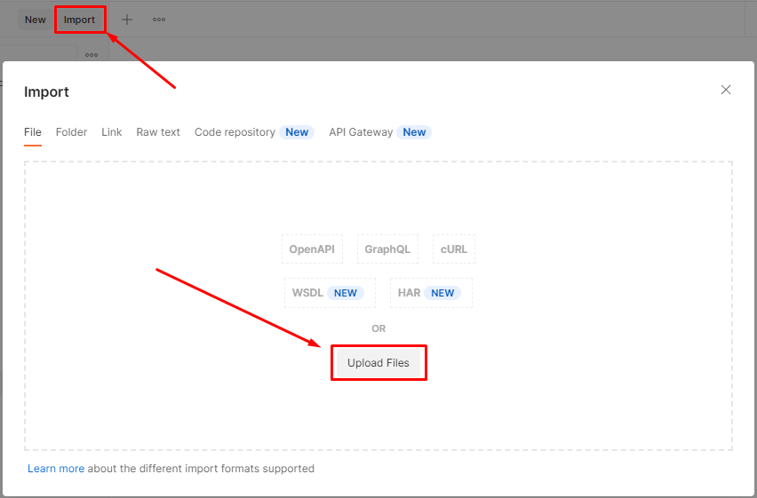

# api-cadastro
Microservico para envio de Email

### Arquivo POSTMAN
Para execução do Postman, importe o arquivo *ms-email.postman_collection.json* que está na pasta:
```shell
file-util/ms-email.postman_collection.json
```
Para fazer a importação do arquivo e já ter o endpoint e o json necessário, faça o seguinte:
Vá no seu Postman e procure o botão Import, conforme marcado na imagem abaixo



Clique em Import -> Upload files, importe o arquivo *ms-email.postman_collection.json*

### Endpoint
### Email
* `/sending-email` With method POST -> Send email

Para realizar o build e executar a aplicação você irá precisar de:

- [JDK 11](https://www.oracle.com/java/technologies/javase/jdk11-archive-downloads.html)
- [Maven](https://maven.apache.org)
- [Postman](https://www.postman.com/downloads/)
- [Postgres](https://www.postgresql.org/download/)

## Base de dados

### Banco Postgres:

Crie um banco de dados via shell ou pgAdmin com o nome `ms-email` com o comando:
```shell
CREATE DATABASE IF NOT EXISTS ms-email
```
Para configuração do Banco Postgres, atente-se ao usuário e senha informado no ato da instalação do seu banco.
No arquivo `application-dev.properties`, faça as seguintes alterações:

spring.datasource.username=`seu usuário`

spring.datasource.password=`sua senha`

#### exemplo:
spring.datasource.username=`postgres`

spring.datasource.password=`12345`

## Executar a aplicação localmente
Há diversas maneiras de se executar uma aplicação Spring Boot localmente. Uma delas é executando o método `main` em 
`src/main/java/com/microservice/sendemail/SendemailApplication.java` a partir da sua IDE.

Você também pode utilizar o [Spring Boot Maven plugin](https://docs.spring.io/spring-boot/docs/current/reference/html/build-tool-plugins-maven-plugin.html) da seguinte maneira:
```shell
mvn spring-boot:run
```